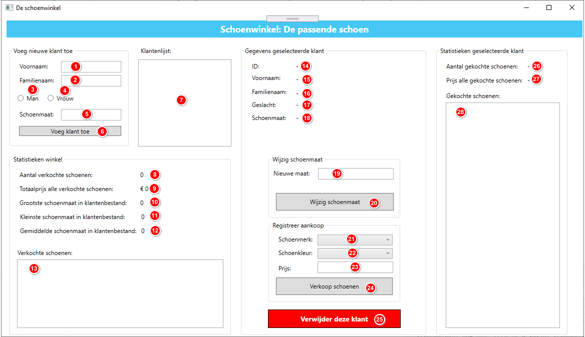
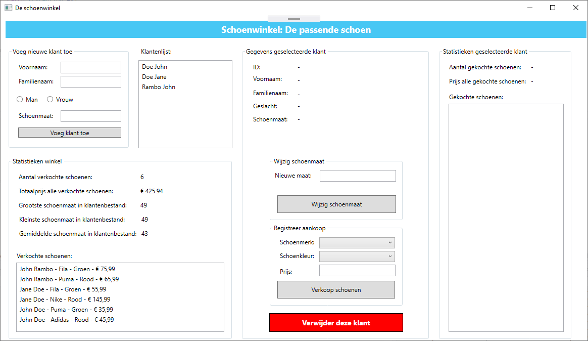
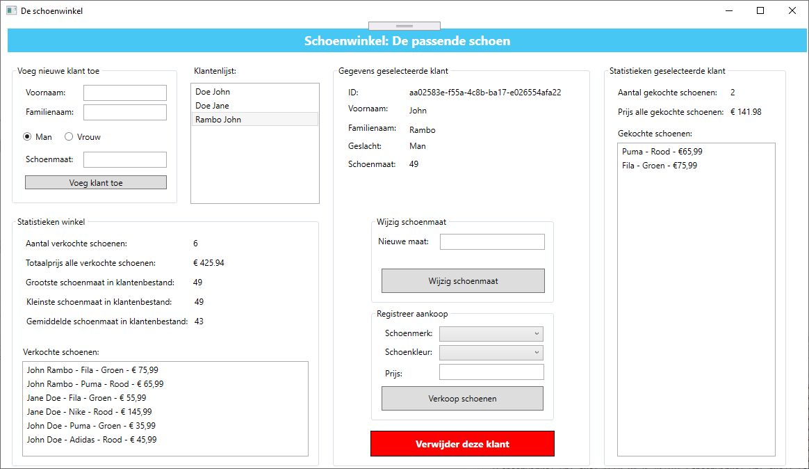
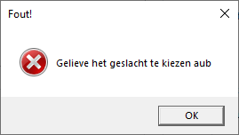
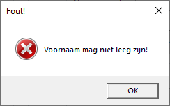

# PE3 Schoenwinkel

## PE3 1920 Sem 1

Lees eerst de volledige opgave alvorens aan deze opdracht te beginnen. Deze opdracht wordt **individueel** gemaakt! 

## De lay-out

**1.** txtVoornaam

**2.** txtFamilienaam

**3.** rdbGeslachtMan

**4.** rdbGeslachtVrouw

**5.** txtSchoenmaat

**6.** btnVoegKlantToe

**7.** lstKlantenLijst

**8.** lblAantalVerkochteSchoenen

**9.** lblPrijsVerkochteSchoenen

**10.** lblGrootsteSchoenmaat

**11.** lblKleinsteSchoenmaat

**12.** lblGemiddeldeSchoenmaat

**13.** lstVerkochteSchoenen

**14.** lblId 

**15.** lblVoornaam 

**16.** lblFamilienaam

**17.** lblGeslacht

**18.** lblSchoenmaat

**19.** txtNieuweSchoenmaat

**20.** btnWijzigSchoenmaat

**21.** cmbSchoenMerk

**22.** cmbSchoenKleur

**23.** txtSchoenPrijs

**24.** btnVerkoopSchoen

**25.** btnVerwijderKlant

**26.** lblAantalGekochteSchoenen

**27.** lblPrijsGekochteSchoenen

**28.** lstGekochteSchoenen

## De opdracht

De bedoeling is om een klantenbestand en diverse statistieken bij te houden van een schoenwinkel.

### Voeg nieuwe klant toe

Zorg ervoor dat de gebruiker nieuwe klanten kan toevoegen door middel van het ingeven van volgende gegevens in de groupbox _Voeg nieuwe klant toe_:

- Voornaam
- Familienaam
- Geslacht (door middel van radiobuttons in de GUI, maar in de code door middel van een **enum**)
- Schoenmaat
- Een ID wordt **automatisch** aangemaakt door middel van een **GUID** (Global Unique Identifier).

### Klantenlijst

Alle klanten dienen zichtbaar te zijn in de klantenlijst (Familienaam Voornaam). Wanneer men op een klant klikt dient men alle details en statistieken van deze klant te zien in de groupbox _Gegevens geselecteerde klant_:

- ID (Guid)
- Voornaam
- Familienaam
- Geslacht
- Schoenmaat

### Wijzigen schoenmaat

Wanneer een klant geselecteerd werd is het mogelijk om zijn schoenmaat te wijzigen door middel van de groupbox _Wijzig schoenmaat_.

Indien de schoenmaat werd gewijzigd dienen alle statistieken (zie verderop) onmiddelijk aangepast te worden, alsook _lblSchoenmaat_ bij groupbox _Gegevens geselecteerde klant_.

### Registreer aankoop

Wanneer een klant geselecteerd werd is het mogelijk om een aankoop te registreren gekoppeld aan deze klant.

Via een combobox kan de gebruiker volgende merken selecteren:

- Adidas
- Nike
- Fila
- Puma

**De gebruiker is verplicht om een merk te kiezen!**

Via een combobox kan de gebruiker volgende kleuren selecteren:

- Rood
- Groen
- Blauw
- Zwart
- Wit

**De gebruiker is verplicht om een kleur te kiezen!**

De prijs dient **verplicht** ingevuld te worden in de textbox.

Bij het drukken op de knop _Verkoop schoenen_ dient de verkoop gekoppeld te worden aan de geselecteerde klant.

### Verwijderen van een klant

Indien een geselecteerde klant verwijderd wordt, worden ook zijn aankopen gewist en worden alle statistieken hierop aangepast (zie verderop) en wordt de klantenlijst aangepast.

### Statistieken geselecteerde klant

Wanneer een klant geselecteerd werd uit de klantenlijst dienen deze statistieken getoond te worden van de geselecteerde klant:

- Aantal gekochte schoenen van deze klant
- De totale prijs van al deze gekochte schoenen van deze klant
- Een lijst van alle gekochte schoenen (van de geselecteerde klant) als volgt getoond: **Merk - kleur - prijs** (bekijk onderstaande foto's als voorbeeld)

### Statistieken winkel

In deze groupbox worden enkele statistieken bijgehouden:

- Aantal verkochte schoenen van alle klanten samen
- Totaalprijs van alle verkochte schoenen van alle klanten samen
- De grootste schoenmaat in het klantenbestand
- De kleinste schoenmaat in het klantenbestand
- De gemiddelde schoenmaat in het klantenbestand
- Een lijst van alle verkochte schoenen van alle klanten samen als volgt getoond: **Voornaam Familienaam - Merk - Kleur - Prijs** (bekijk onderstaande foto's als voorbeeld)

## Afbeeldingen

## Vereisten

In deze opdracht wordt alle opgedane kennis toegepast:

- Correct gebruik van methoden
- Selectie
- Enums en Lists
- Lussen
- Errors & exceptions
- Klassen & objecten
- Properties

- Zorg ervoor dat de gebruiker geen foutieve data kan ingeven:

  - Indien de gebruiker geen of lege data ingeeft, dien je de gebruiker op de hoogte te brengen doormiddel van het gooien van een exception.
  - Denk na over welke fouten de gebruiker nog kan maken (verwijderen niet geselecteerde klant, ...) en vang deze passend op doormiddel van exceptions.
  - Controleer zoveel mogelijk op fouten in de klasse, zo min mogelijk in de code-behind. De foutboodschap zelf vang je uiteraard wel op in je code-behind om deze te kunnen tonen aan de gebruiker.
  - Enkele voorbeelden:

    

    

    

    **Denk zelf na over andere foutmeldingen.**

- Bij elke wijziging (schoenmaat, aankoop, ...) dienen alle statistieken en data aangepast te worden aan de nieuwe data.
- Gebruik voor het geslacht een enum.
- Maak gebruik van een klassenbibliotheek en voorzie volgende klassen:
  - Winkel
  - Klant
  - Aankoop
- Voorzie passende members (properties, fields, methoden) bij de passende klasse.
- Een schoenmaat heeft een minimumwaarde van **10** en een maximumwaarde van **50**.
- Vergeet de conventies voor onze opleiding (naamgeving, commits, ...) niet toe te passen! Deze zijn  te vinden.
